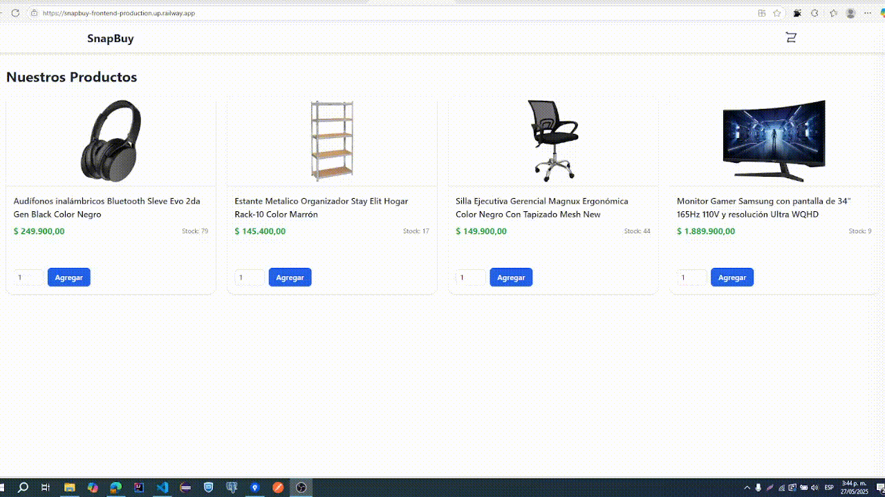
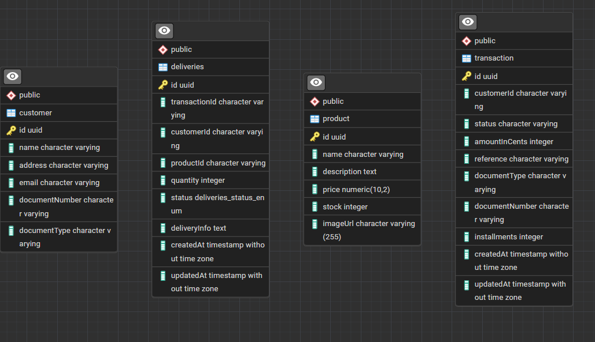
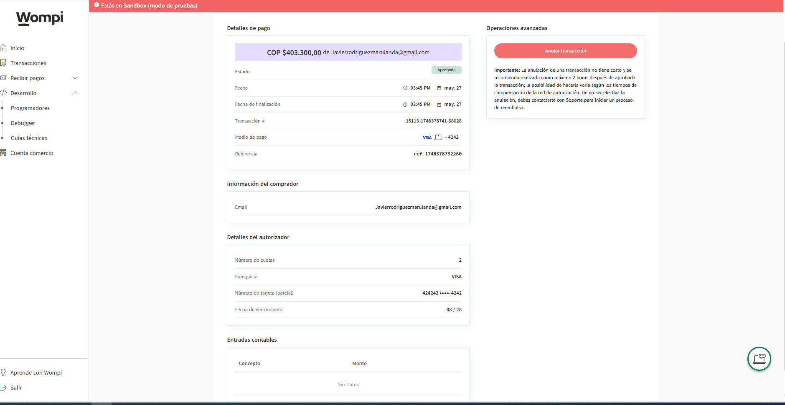

<p align="center">
  
</p>

<p align="center">
  <b>SnapBuy</b> · A modern FullStack E-commerce App using <a href="https://reactjs.org/">React</a>, <a href="https://nestjs.com/">NestJS</a>, and <a href="https://wompi.co/">Wompi</a> for payments.
</p>

---

##  Tech Stack

- **Frontend:** React 18, Redux Toolkit, Tailwind CSS, Vite, Yup + React Hook Form
- **Backend:** NestJS, PostgreSQL, TypeORM, Validation Pipes, Custom Exception Filters
- **Payments:** Wompi (Sandbox)
- **Tools:** Docker-ready, ESLint + Prettier, RESTful API, CORS

---

##  Project Structure

```bash
snapbuy/
├── frontend/               # React SPA
│   ├── components/         # Shared UI components
│   ├── features/           # Redux slices and domain logic
│   ├── hooks/              # Custom hooks (e.g., usePayment)
│   ├── routes/             # App routing
│   └── services/           # API and Wompi integrations
├── backend/                # NestJS RESTful API
│   ├── src/
│   │   ├── products/       # Product entity & controller
│   │   ├── customers/      # Customer registration
│   │   ├── deliveries/     # Delivery creation per transaction
│   │   ├── transactions/   # Record of transactions
│   │   └── common/         # Pipes, filters, interceptors
│   ├── .env                # Environment configuration
│   └── config/             # TypeORM and other configs
```

---

##  Getting Started

### Backend

```bash
cd backend
cp  .env  
npm install
npm run start:dev
```

### Frontend

```bash
cd frontend
cp .env 
npm install
npm run dev
```

---

##  Payment Flow

1. User selects product → adds to cart.
2. Proceeds to checkout → submits form.
3. Client actions:
   - Create customer (`POST /customers`)
   - Create delivery (`POST /deliveries`)
4. If approved:
   - Record transaction (`POST /transactions`)
   - Update stock (`PATCH /products/:id/stock`)

---

##  Testing

```bash
npm run test          
npm run test:e2e      
npm run test:cov     
```

---

##  Deployment

- Use `.env.production` for production builds.
- Frontend: Host with Vercel, Netlify, etc.
- Backend: Deploy to Railway, Render, or similar.

---

##  Useful Commands

```bash

npm start               # Dev mode
npm run build           # Compile


npm start               # Start dev server
npm run build           # Build production bundle
```

---

##  Video



##  Model DB 


---
##  Resultado


---

##  Cobertura del backend en Tests

-------------------------------------|---------|----------|---------|---------|----------------------
File                                 | % Stmts | % Branch | % Funcs | % Lines | Uncovered Line #s    
-------------------------------------|---------|----------|---------|---------|----------------------
All files                            |   78.26 |    56.41 |   90.56 |   78.49 |                      
 src                                 |       0 |        0 |       0 |       0 |                      
  app.module.ts                      |       0 |      100 |       0 |       0 | 2-34                 
  main.ts                            |       0 |        0 |       0 |       0 | 1-64                 
 src/common/filters                  |     100 |      100 |     100 |     100 |                      
  http-exception.filter.ts           |     100 |      100 |     100 |     100 |                      
 src/common/interceptors             |     100 |      100 |     100 |     100 | 
  logging.interceptor.ts             |     100 |      100 |     100 |     100 | 
 src/common/pipes                    |     100 |      100 |     100 |     100 | 
  validation.pipe.ts                 |     100 |      100 |     100 |     100 | 
 src/customers                       |     100 |      100 |     100 |     100 | 
  customers.controller.ts            |     100 |      100 |     100 |     100 | 
  customers.module.ts                |     100 |      100 |     100 |     100 | 
  customers.service.ts               |     100 |      100 |     100 |     100 | 
 src/customers/dto                   |     100 |      100 |     100 |     100 | 
  create-customer.dto.ts             |     100 |      100 |     100 |     100 | 
  update-customer.dto.ts             |     100 |      100 |     100 |     100 | 
 src/customers/entities              |     100 |      100 |     100 |     100 | 
  customer.entity.ts                 |     100 |      100 |     100 |     100 | 
 src/deliveries                      |   80.95 |      100 |     100 |   83.33 | 
  deliveries.controller.ts           |     100 |      100 |     100 |     100 | 
  deliveries.module.ts               |       0 |      100 |     100 |       0 | 1-14
  deliveries.service.ts              |     100 |      100 |     100 |     100 | 
 src/deliveries/dto                  |      75 |      100 |       0 |      75 | 
  create-delivery.dto.ts             |    90.9 |      100 |       0 |    90.9 | 23
  delivery-info.dto.ts               |     100 |      100 |     100 |     100 | 
  delivery.dto.ts                    |       0 |      100 |     100 |       0 | 2-21
  update-delivery.dto.ts             |     100 |      100 |     100 |     100 | 
 src/deliveries/entities             |     100 |      100 |     100 |     100 | 
  delivery.entity.ts                 |     100 |      100 |     100 |     100 | 
 src/payment                         |   76.78 |       80 |     100 |   79.16 | 
  payments.controller.ts             |     100 |      100 |     100 |     100 | 
  payments.module.ts                 |       0 |      100 |     100 |       0 | 1-24
  payments.service.ts                |   97.05 |       80 |     100 |     100 | 81
 src/payment/dto                     |     100 |      100 |     100 |     100 |
  create-payment.dto.ts              |     100 |      100 |     100 |     100 |
  product-order.dto.ts               |     100 |      100 |     100 |     100 |
 src/products                        |   76.47 |      100 |     100 |   77.77 |
  products.controller.ts             |     100 |      100 |     100 |     100 |
  products.module.ts                 |       0 |      100 |     100 |       0 | 1-14
  products.service.ts                |     100 |      100 |     100 |     100 |
 src/products/dto                    |     100 |      100 |     100 |     100 |
  update-product.dto.ts              |     100 |      100 |     100 |     100 |
 src/products/entities               |     100 |      100 |     100 |     100 |
  product.entity.ts                  |     100 |      100 |     100 |     100 |
 src/transactions                    |   78.94 |      100 |     100 |   80.64 |
  transactions.controller.ts         |     100 |      100 |     100 |     100 |
  transactions.module.ts             |       0 |      100 |     100 |       0 | 1-14
  transactions.service.ts            |     100 |      100 |     100 |     100 |
 src/transactions/dto                |   69.56 |      100 |     100 |   69.56 |
  create-general-transaction.dto.ts  |     100 |      100 |     100 |     100 |
  create-transaction.dto.ts          |       0 |      100 |     100 |       0 | 1-35
  internal-create-transaction.dto.ts |     100 |      100 |     100 |     100 |
  update-transaction.dto.ts          |     100 |      100 |     100 |     100 |
 src/transactions/entities           |     100 |      100 |     100 |     100 |
  transaction.entity.ts              |     100 |      100 |     100 |     100 |
 src/wompi                           |   63.63 |    17.64 |   71.42 |   64.38 |
  wompi.controller.ts                |       0 |        0 |       0 |       0 | 1-45
  wompi.service.ts                   |   83.05 |    18.75 |     100 |   82.45 | 56,63-69,108,223-229
-------------------------------------|---------|----------|---------|---------|----------------------

##  Cobertura del frontend

- Las pruebas se hicieron en cuanto a confirmar que no hay errores de compilación o renderizado.
- Asegurarte de que el componente no explota al montarse.

 PASS  src/features/products/productSlice.test.ts
 PASS  src/components/Stepper.test.tsx
 PASS  src/components/Header.test.tsx
 PASS  src/App.test.tsx
 PASS  src/hooks/useCart.test.tsx
 PASS  src/hooks/useAppDispatch.test.ts
 PASS  src/features/customer/DeliveryForm.test.tsx
 PASS  src/components/LoadingOverlay.test.tsx     
 PASS  src/features/customer/customerSlice.test.ts
 PASS  src/features/cart/cartSlice.test.ts
 PASS  src/features/transaction/transactionSlice.test.ts

Test Suites: 11 passed, 11 total
Tests:       38 passed, 38 total
Snapshots:   0 total
Time:        3.246 s
